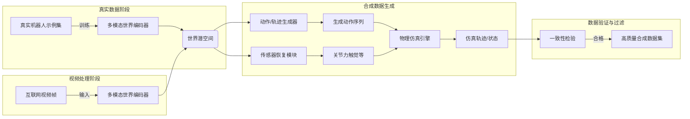

# RDAE v1.0 白皮书

## 执行概要  
随着基础模型时代来临，机器人领域亟需**大规模、多样化的训练数据**来支撑通用化决策系统。然而，现有真实遥操作数据集体量有限（如RoboTurk约100小时、DROID 350小时、BridgeData V2 60k演示），远远无法与互联网视频规模相提并论。为此，RDAE（Robot Data Amplification Engine）提出通过**构建世界状态编码器**和**传感器反推模型**，将网络视频转换为机器人训练数据。我们的总体架构分为：**阶段1**利用真实机器人数据训练多模态世界编码器；**阶段2**从海量互联网视频中提取视频帧，生成“世界潜空间”表示；**阶段3**通过动作/传感器解码器将潜空间映射为机器人动作序列与内部传感器数据；**阶段4**在物理仿真中验证并过滤合成数据。该方法融合了近年先进的**视频预训练**和**动作生成**技术（例如Video2Policy、AMPLIFY、ViPRA、LAPA等），并通过仿真一致性检验来确保数据质量。我们预计通过RDAE，可将极少量真实数据（如1万小时）扩增至百万小时级别的**合成机器人数据**，从而大幅降低数据采集成本，并加速具身智能发展。本白皮书详述RDAE的需求、架构、算法设计、数据格式、训练与评估方案，以及工程实施路径，供投资决策和技术评审参考。  

## 项目背景与动机  

- **数据瓶颈**：当前机器人学习主要依赖遥操作示例或仿真数据，但获取成本高、数量少难以泛化。典型数据集规模：RoboTurk真实操控数据仅2144条示例；DROID提供了350小时/76k轨迹；BridgeData V2约60k轨迹。与此相比，互联网视频资源极其丰富（例如人类在线视频播放时长达数十亿小时），但缺乏直接标注，无法直接用于机器人学习。  
- **行业趋势**：近期研究表明，预训练型VLA（Vision-Language-Action）模型若能利用海量视频，无监督提取运动先验，可显著提升少样本下的表现。例如AMPLIFY利用大规模视频学习运动表示，从少量真实动作数据中学习策略；LAPA和ViPRA通过学习潜在动作编码，实现了纯视频预训练对VLA模型的增强。这显示“视频能为机器人智能提供丰富的物理与语义先验”。  
- **动机**：在上述背景下，我们提出RDAE，通过构建**世界状态编码器**和**缺失传感器重建模块**，将视频“实体行为”转换为机器人可用的观测-动作对，旨在打造“机器人领域的公共语料+数据工厂”。该思路类似于大型语言模型利用互联网文本预训练：我们利用互联网视频并结合有限真实数据，生成大规模合成机器人数据，降低物理采集成本。与现有“视频到策略”工作不同，RDAE不仅输出动作，还重建机器人内部状态（关节、力、触觉等），并通过仿真校验确保真实性。  

## 相关工作与参考文献  

- **遥操作数据集**：RoboTurk 等开放了遥操作数据，用于学习可视化下的长时任务；DROID 提供多环境、多任务的 350 小时示例；BridgeData V2 数据集涵盖 13 种技能、24 个环境共 60k 演示。这些数据推动了多技能模仿学习和离线 RL，但规模仍受限于物理采集。  
- **仿真和桥接数据**：仿真环境（如MuJoCo、Isaac Sim）常用于生成高质量、廉价的合成数据，但存在机器人体型差异和仿真误差。**数据利用定律**指出，约 8 条仿真样本对等于 1 条真实样本的效用，而约 10 条人类视频样本甚至可能抵消 1 条真实样本的收益。这提示我们在直接使用视频时需谨慎，但适当的转换与验证策略可放大视频价值。  
- **视频到策略方法**：最新工作探索利用人类视频学习机器人策略。Video2Policy通过重建视频中的对象网格和轨迹，将日常行为转化为仿真任务并使用 LLM 生成奖励训练策略；ViPRA将视频预测模型应用于机器人控制，学习潜在连续动作并用光流一致性对其校正；LAPA使用 VQ-VAE 将相邻帧的运动量化为离散潜在动作，无监督预训练 VLA 模型并在少量真机数据上微调；AMPLIFY分离前向/逆动力学，分别在视频和少量带动作的示例上训练，显著提升了少样本成功率。Rhoda AI 提出的“直接视频-动作模型（DVA）”将机器人控制归结为视频生成，通过预测未来视频帧再用逆动力学映射为动作，实现了高效学习和可视化控制。以上方法表明，将大规模视频和有限真实数据结合，可得到更强的机器人策略。  
- **世界模型与物理建模**：物理世界模型（actionable world models）趋向从视觉重建物体状态以预测动力学。例如《Actionable World Representation》提出 WorldString，直接从 RGB-D 视频学习物体的可操作数字孪生。类似地，我们的多模态世界编码器应捕捉环境实体和动态状态，为后续解码器提供信息。前沿工作如DreamGen、UniSim等也探索了大规模视频生成+动作扩散方法（见中的相关引用）。  

下面表格总结了**代表性方法**与特点：  

| 工作 | 类型 | 数据来源 | 主要方法 | 参考文献 |
|:----:|:----:|:-------:|:-------:|:-------:|
| RoboTurk (2019) | 遥操作 数据集 | 人工遥操作 | 收集 3 任务演示，提供同步 RGB-D + 关节数据 | Rohit et al., IROS 2019 |
| DROID (2024) | 遥操作 数据集 | 全球多机构遥操作 | 50 多个遥操作者，收集 564 场景，76k 演示 | Dmitry et al., arXiv 2024 |
| BridgeData V2 (2024) | 遥操作 数据集 | 固定平台遥操作 | 60k 轨迹，24 个环境，支持语言/图像目标 | Walke et al., CoRL 2024 |
| Teleportation Law (2025) | 数据分析 | 三种数据类型 | 建立真实/仿真/视频样本效用换算率（8:1: ~0.1） | Shi et al., ICLR 2026 |
| Video2Policy (2025) | 方法论文 | 人类视频 (SSv2) | 视频物体重建+追踪→仿真任务生成+RL策略训练 | Ye et al., ICLR 2025 |
| ViPRA (2025) | 方法论文 | 人类/机器人视频 | 视频预测+潜在动作预训练，用光流一致性校正 | Routray et al., NeurIPS 2025 |
| LAPA (2025) | 方法论文 | 人类视频 | VQ-VAE 构建离散潜在动作，预训练 VLA 模型 | Ye et al., ICLR 2025 |
| AMPLIFY (2024) | 方法论文 | 视频 + 少量动作示例 | 先前向运动模型再逆模型，高效学习人类视频中的运动先验 | Collins et al., ICRA 2024 |

上述工作表明：**利用互联网视频与小样本真实示例联合训练**是提升机器人策略泛化和数据效率的有效途径。RDAE 在此基础上进一步**解耦多模态世界表示**与**机器人内部状态重建**，目标构建一个完整的数据放大引擎。  

## 系统总体架构  

RDAE 系统分为四个阶段：**（1）真实数据训练阶段**，**（2）互联网视频阶段**，**（3）合成数据生成与验证**，**（4）模型训练与闭环优化**。总体流程如下：  

- **Stage 1：真实数据训练**。使用真实机器人系统（如固定台式机械臂）采集的遥操作/示教数据集（包括同步的RGB-D图像、关节状态、末端位姿、力/触觉读数等）。这些数据用于训练**Multi-Modal World Encoder**，学习将高维感知与状态映射到紧凑的**世界潜空间（world latent）**。可借鉴 Video-Language-Action (VLA) 模型中使用的双流网络或Transformer结构，将视觉和机器人自身状态联合编码。  
- **Stage 2：视频处理**。将预处理后的互联网视频帧输入同一编码器，生成相应的世界潜空间表示。此阶段编码器可直接迁移，或者在Stage1基础上进行域自适应微调，以适应非机器人视频场景中的视觉特征。  
- **Stage 3：合成数据生成**。从世界潜空间分别通过动作解码器（Action/Trajectory Generator）和传感器解码器（Missing Sensor Reconstruction）得到机器人控制动作序列和估计的内部传感器数据（关节、力、触觉等）。动作生成可采用扩散模型、变换器或混合方法，输出高频连续控制。传感器恢复模块利用世界状态和预测动作推断机器人执行时的力触觉反馈，类似逆动力学，但利用训练时同步采集的数据进行监督。  
- **Stage 4：物理验证与数据过滤**。将预测的动作序列送入物理仿真（如Isaac Sim、MuJoCo等），并将传感器输出作为反馈，与世界潜空间表示进行比较。一致性检验（Consistency Check）评估预测动作和传感器与视频目标行为的一致性，筛选出高质量的数据段。最终输出可用于训练下游策略（如Diffusion Policy、π0、ACT等）和世界模型。  

该整体架构结合了最新的**视频预训练**与**动作生成**技术，同时利用仿真校验保证数据真实性。如图所示，RDAE 将庞大的互联网视频“拉回”到机器人可理解的**观测-动作空间**，形成一个“数据放大闭环”。  

## 模块设计与技术细节  

- **多模态世界编码器**：该模块将视觉输入（RGB、深度图）与机器状态（如关节角度、末端位姿）融合编码为“世界潜空间”向量。可采用双流或融合网络架构：例如，用ResNet/ViT提取视觉特征，用小型 MLP 编码机器人内在状态，两者拼接后过Transformer或自注意力层。编码器可预训练视觉部分（如 DINOv2），并通过多任务学习（比如重建视频帧、预测未来帧、对比学习）获得丰富表示。编码输出即**World Latent**，维度可设为256–1024维，既要能重建场景关键要素，也应包含动态信息。  
- **世界潜空间（World Latent）**：作为系统的中间表示，需反映场景中*可操作物体*的状态与属性，以及机器人本身的作用效果。这一潜空间将被解码为具体任务信号。借鉴中物理世界模型，将物体视为具有内在状态和可变形属性的实体，World Latent 应包含每个物体的位姿、运动状态、物理属性（刚度、质量等）等隐信息。为此，可设计世界潜空间为多维张量或若干对象特征向量集合，支持下游操作和预测。  
- **效用/动力/材质解码器（Affordance / Dynamics / Material Decoders）**：这些解码器分别预测物体的可交互性、动力学参数和材质属性。如，**Affordance Decoder**可以输出场景中各物体可执行的操作类别（抓取、推拉、旋转等）；**Dynamics Decoder**预测运动相关参数（质量、摩擦系数、弹性等）；**Material Decoder**分类物体材质（玻璃、塑料、金属等）。这些解码器可使用小型神经网络或图网络（利用潜空间中物体节点）。目前相关工作较少直接预测物理属性，但可参考3D重建和物理参数估计方法。预测出的物理属性将用于仿真验证阶段，提高一致性准确性。  
- **缺失传感器重建模块**：该模块根据世界潜空间和生成的动作序列推断机器人执行时的内部传感器读数，包括**关节状态**（角度/速度）、**力/力矩**和**触觉**等。方法上可视作逆动力学建模：利用多模态编码器学习的世界状态隐变量，加上已预测的末端动作，预测对应的关节运动和反馈。实现方式可采用多任务回归网络，训练时用真实数据中的同步传感器读数作为监督。该模块的输出丰富了合成数据，让下游训练可使用机器人所有模态信息，提高策略学习效果。  
- **动作/轨迹生成器**：该模块基于世界潜空间预测具体的机器人控制动作序列。可采用时序模型（Transformer、LSTM）或生成模型（扩散模型、混合专家）。例如借鉴 **Diffusion Policy (π₀)** 的架构，对目标状态进行逆过程生成；或者使用单步预测加动作衔接的策略。训练时使用真实示教数据学习世界状态与动作序列的映射损失（例如MSE、对比损失等）。此处也可融入语言指令或任务描述作为额外条件。目标是生成**高频连续动作**（如22Hz控制频率），保证机器人能平滑执行复杂操作。  
- **物理仿真验证**：在仿真环境中执行生成的动作序列，并通过传感器解码器的输出进行一致性检验。仿真可使用 Isaac Sim、MuJoCo 等，高精度模拟关节动力学和物体物理交互。将仿真轨迹与原视频或世界潜空间中的预期行为进行对比，计算误差指标（如末端位置误差、接触力差异等）。设定阈值筛除物理不合理或不匹配的视频样本。仿真验证是RDAE的核心风险控制模块，保证只有**高保真**的合成数据用于后续训练。   

上述模块通过端到端训练管道协同工作：首先在真实数据上训练编码器和解码器；然后用固定编码器对视频进行前向推理；最后解码器产生动作/传感器并经仿真过滤。架构示意图如上所示（红白科技风格可参考上文Mermaid流程）。  

## 数据需求与数据格式  

RDAE需处理**真实数据**与**合成数据**两类：前者用于训练，后者用于评估和数据扩增。我们将采用统一格式（参考RobotDataset、TFRecord、MCAP等结构）记录多源信息，包括时间戳、相机图像、机器人状态及动作等。建议包含字段如下：  

| 字段             | 真实数据 (机器人采集)       | 合成数据 (RDAE 生成)      |
|:-----------------|:--------------------------|:------------------------|
| 时间戳           | 绝对UTC或ROS时间          | 绝对时间/仿真时间        |
| RGB 图像         | 机器人摄像头采集          | 可同事仿真镜头生成或原视频 |
| 深度图           | 如有深度传感器            | 仿真可输出深度           |
| 关节状态 (角度/速率) | 机器人反馈 (Encoder读取) | 解码器预测或仿真反馈     |
| 末端位姿 (TF)    | 机器人正运动学计算/标定     | 解码器预测或仿真输出     |
| 末端力/力矩      | 力传感器读数             | 解码器预测或仿真输出     |
| 触觉分布         | 触觉传感器 (如果有)       | 解码器预测或仿真触觉网格 |
| 执行动作 (命令)   | 人工操纵命令 (Joint目标)   | 解码器输出动作序列       |
| 语言指令/描述    | 如有附加任务说明          | 同步附加，或空         |
| 物体标签/位置    |（可选）摄像头检测输出     | （可选）仿真真值标签     |

真实数据由遥操作平台采集，可能包含丰富传感器；合成数据由RDAE模块生成，上表中“解码器预测或仿真输出”即为RDAE的目标输出信息。两类数据格式一致，便于模型训练。参考 LeRobotDataset[2†L117-L126]提出的视频编码存储方式，可将RGB-D以MP4压缩存储以节省空间，同时对动作/状态数据使用精简二进制格式（如MCAP）以加速读取。  

**真实 vs 合成数据区别：**  
- 真实数据是真实交互，包含噪声和未观测物体细节；合成数据来自视频重构，可能有估计误差。  
- 合成数据可包含视频帧无的标注（如物体3D网格），有助于训练世界模型和评估。  
- 合成数据缺少真实传感器噪声，可通过仿真加噪或数据增强逼真化。  

下表概括了两者的主要差异：  

| 特性             | 真实数据                     | 合成数据                     |
|:-----------------|:---------------------------|:---------------------------|
| 可用规模         | 通常数百小时级              | 数百万小时级（可扩展）       |
| 标注成本         | 高（需要同步采集与标注）    | 低（通过模型生成伪标签）     |
| 物理一致性       | 高（真实环境）              | 依赖仿真精度和模型预测       |
| 多样性           | 受限于采集场景              | 来源于多样视频               |
| 数据格式         | ROSbag/MCAP 全信息          | 同上（含虚拟传感器输出）     |
| 示例接口         | $\{$image, joint, action, force, tactile, …$\}$ | $\{$image, joint*, action, force*, tactile*, …$\}$ （*为预测） |

## 训练方案  

RDAE 训练可分为**预训练**和**微调**两大阶段：

- **预训练（无监督/弱监督）**：在该阶段，利用**动作自由视频**（未标注机器人动作）对世界编码器和前向动力学模型进行预训练。例如，可使用Video2Policy中描述的物体重建跟踪技术辅助生成伪标签，或者直接进行视频预测任务。具体可采用以下策略：  
  - **自监督学习**：对编码器进行对比学习或重建目标，如时序连续帧的预测重建、未来帧重建、光流预测等。利用优化器（如Adam）和重建损失（L2/MSE或感知损失）训练编码器，使其潜空间捕获场景动态。  
  - **隐行动力学学习**：参考ViPRA和LAPA的思想，引入**潜在动作编码**。例如，用VQ-VAE对视频帧间运动进行向量量化训练，学习离散“动作”表示；或者训练视频预测模型（如3D Transformer）生成未来帧，并让网络内部隐变量对应潜在动作。可加入光流一致性损失确保隐变量具备物理意义。   
  - **物理先验**：引入动力学约束，如世界潜空间经过物理解码器（WorldString 风格）能反演出合理的3D物体状态。增加物理仿真反馈作为正则化，如模拟在潜空间上推进一步状态应与编码器预测一致（模拟-编码一致性损失）。  
  - **数据量**：此阶段可以使用海量开放视频（如Something-something、YouTube剪辑集），规模建议达到**百万级别帧**。训练时每次取一段视频片段（如5–10秒），批处理规模可从32到256不等，训练200k–500k步。学习率可取1e-4，优化器AdamW等。  

- **微调（监督）**：在编码器已有基本表示后，用**有限真实数据**进行微调，使其更贴近机器人视角和任务。此时加入**逆动力学和传感器预测损失**：即将世界潜空间与已知真实动作/传感器对一一对应进行回归训练，最小化预测误差。  
  - **多任务损失**：总体损失可为$\lambda_1$ * 视频重建损失 + $\lambda_2$ * 关节预测损失 + $\lambda_3$ * 力预测损失 + $\lambda_4$ * 轨迹预测损失 + …，其中各项权重可调节，确保编码器既能表征视频也能映射到机器人内部。  
  - **因果约束**：参考“数据利用定律”中提出的思想，在训练时监控加入视频数据对实际策略性能的影响，动态调整视频样本比例。如果发现视频添加降低实时策略成功率（类似所述），可下调相应损失权重或增加仿真一致性惩罚。  
  - **预训练+微调策略**：先在视频数据上训练世界编码器和前向模型，再用少量真实数据微调所有网络（包括动作和传感器解码器）。或者采用逐层微调：先冻结编码层，只训练解码器；达到稳定后再联合调优全部参数。  

- **训练细节示例（MVP配置）**：  
  - **视觉编码器**：采用ResNet-50或ViT-B/16预训练权重，输出512维特征。  
  - **世界编码器**：在视觉特征后接两层Transformer，输出世界潜空间$z_w$（维度256）。  
  - **动作解码器**：构建扩散策略模型（Diffusion Policy π₀），使用100步正向高斯噪声。训练时使用真实轨迹作为目标，AdamW，学习率2e-4。  
  - **传感器解码器**：3层MLP，输入$z_w$与动作，输出关节角度变化和受力预测。损失函数为L1/L2回归误差。  
  - **优化器与超参**：所有模块使用AdamW，批量大小64，初始学习率1e-4，每10万步衰减。训练共100万步，或直到验证集误差收敛。  
  - **评估脚本**：在验证集视频上，计算动作生成的归一化距离误差（Normalized Mean Error）、关节预测RMSE、仿真任务成功率等指标。通过Python脚本调用PyTorch模型进行推断，并统计误差。  

## 评估与验证  

**定量指标**：评估时需考虑合成数据的质量和下游策略提升。常用指标包括：  
- **预测误差**：动作生成的均方误差（MSE）、关节角度预测误差、受力预测误差等；视频帧前向预测损失；世界潜空间重构误差等。  
- **仿真一致性**：将生成动作在仿真中执行，计算末端执行目标（如抓取位置）的误差，以及模拟受力与预测力的差异。定义**一致性分数**（Consistency Score），将差异纳入0–1评估，分数高者为高质量样本。  
- **任务成功率**：在仿真或真实环境中，用含/不含合成数据训练的策略执行代表性任务（如搬运、装瓶等），比较成功率。根据Teleportation Law，评估加入不同数量合成数据后成功率变化，验证数据放大效益。  
- **泛化性能**：在与训练集不同的新场景或新物体上评估策略表现。合成数据多样性预期提高泛化能力，应通过对比实验验证。  

**仿真一致性流程**：如上图所示，对于每段生成的数据，先在仿真中复现，采集仿真返回的传感器读数，与原预测进行比对。设计过滤逻辑，例如“末端位置误差<5cm 且 受力差<0.5N”则视为有效样本，反之丢弃。此步骤严格过滤掉对标记不佳或仿真难以匹配的视频片段，提高训练数据质量。  

**质量评分与A/B测试**：对通过一致性检验的数据赋予高信度标签，可构建对比实验：**A组**使用真实数据训练的策略；**B组**在其基础上加入合成数据训练。比较两组的任务成功率、学习曲线等，验证RDAE合成数据的价值。指标可采用机器人学常用的成功率、路径效率（SPL）、仿真误差等。  

## MVP开发计划与里程碑  

为快速验证RDAE可行性，我们规划如下迭代路线：  

| 阶段      | 时间         | 主要目标                              | 可交付成果                             | 人员&资源                |
|:---------:|:------------:|:-------------------------------------|:---------------------------------------|:------------------------|
| **阶段1** | 0–3个月      | 搭建数据管道与基线模型： - 收集小规模真实数据（如Laundry任务） - 实现Multi-Modal编码器（视觉+关节） - 实现初步动作解码器和仿真接口 | 数据流水线原型（ROSBag/MCAP管道） 初始编码器模型 仿真验证脚本 | 1名算法工程师 1台GPU服务器 |
| **阶段2** | 3–6个月      | 扩展互联网视频流程： - 开发视频抓取和预处理工具 - 利用阶段1模型生成合成数据（小规模） - 实现一致性过滤机制，输出初步合成数据集 | 视频爬取及处理工具 初步合成数据样本 过滤策略报告 | +1名数据工程师 额外存储资源 |
| **阶段3** | 6–9个月      | 增强模型能力： - 训练多任务编码器（加预训练/对比学习） - 优化动作/传感器解码器，提高预测精度 - 收敛一致性评分机制，动态调整过滤阈值 | 优化后的RDAE模型与训练脚本 质量验证报告 合成数据集 v1 | +1名研究员 多GPU训练集群 |
| **阶段4** | 9–12个月     | 集成与演示： - 批量生成合成数据集（百万级帧） - 用合成数据增强VLA策略训练并评估 - 制作Demo视频脚本与预演 | 完整RDAE平台原型 性能提升评估报告 MVP演示视频脚本 | 团队合作：算法+工程 预算 30万人民币 |

每阶段均以迭代评审驱动：如周期性内部演示模型效果，用A/B测试结果指导下一阶段重点。上述时间表为**初始规划**，实际进度视团队规模与外部资源而定。  

## 工程实现细节  

- **数据管道**：构建爬虫自动抓取互联网视频（如YouTube下载工具、Bilibili API），对视频进行分帧采样和标注处理。使用 YOLO/DINO 等预训练模型对视频帧中物体进行初步检测，并记录3D标注（若可得）。将原始视频帧和机器人采集的图像存入高效格式（MP4压缩视频＋MCAP串流）。数据管道支持并行处理，必要时采用Kubeflow/TiKV等系统管理大规模数据。  
- **标注自动化**：对真实数据中的物体分类和位姿，可利用视觉SLAM或基于深度学习的物体重建工具自动生成初步标签；互联网视频可使用LLM或知识库自动生成动作描述。RDAE本身会生成“伪标签”——传感器数据与动作作为标注。记录过程中务必保留完整TF树（各坐标系定义），以供仿真复现。  
- **模型部署**：选用PyTorch等框架实现模型，部署在包含NVIDIA A100/A800 GPU的集群上。动作生成器如使用扩散模型，需考虑其推理效率。目标是批量生成时每个视频片段（10秒）用时不超过几分钟。最终部署为Python API或微服务：输入视频或世界潜空间，输出动作/传感器序列。  
- **推理性能**：预计RDAE非实时生成，可容忍秒级延迟。假设每秒视频处理需生成~500ms的动作，要求模型端到端推理时间＜100ms。为此可使用TensorRT加速、模型蒸馏等优化方法。  
- **集群需求**：训练阶段建议配置8–16块GPU（如8×A100），并配备高速存储（SSD阵列）存放百万级数据集。推理阶段可使用2–4块GPU做在线生成。所有运算均在离线服务器完成，不依赖Edge设备。  
- **持续迭代**：将RDAE工具链以模块化开源形式发布（GitHub），持续更新数据源和模型。与Robotics社区共享标准化数据集格式（如LeRobotDataset），促进生态建设。  

## 风险与对策  

- **技术风险**：视频到状态的转换可能具有**本质模糊性**（如无法确定杯中液体质量）。对策：结合物理仿真反馈，保守估计；并通过引入多模态（语义标签、语言）减少歧义。  
- **数据偏差**：互联网视频场景分布与目标任务不匹配，可导致合成数据分布偏离目标。对策：通过任务筛选（聚焦家居场景）、数据增强（随机背景、光照）等缓解；并在数据管道中加入选定标签。  
- **仿真-现实差距**：生成的数据在仿真中可能没问题，但真实执行偏差。对策：引入域随机化，在仿真验证中加入随机扰动；最终需在真实机器人上小规模验证，并调整物理参数。  
- **法律/隐私**：使用互联网视频可能涉及版权。对策：优先使用开源或共享许可视频（Creative Commons）；生成的数据仅用于模型训练，不直接分发视频内容。  
- **计算成本**：大规模视频处理和模型训练计算量巨大。对策：利用分布式计算架构，采用视频编码压缩数据减小存储与带宽消耗。结合云资源和在地集群，平衡成本与效率。  

## 开源与商业化路线  

- **开源许可**：RDAE平台拟采用Apache 2.0许可证开源，以促进学术和工业界共建。模型和工具将发布于GitHub，并提供可复现的训练/评估脚本。  
- **API/SDK**：计划开发数据生成与验证的API接口或SDK，用户可提供视频或任务描述，获取合成训练样本。例如面向机器人厂商的RESTful服务或ROS节点插件。  
- **合作模式**：与机器人公司、研究所合作，将RDAE集成到其数据扩充流程中。比如家用服务机器人厂商可用RDAE生成多样化抓取数据，自动化工厂可用其生成装配数据。  
- **潜在客户**：主要面向有大量数据需求的**通用机器人公司**和**AI 模型开发者**。例如无人机、自动驾驶（也可使用类似技术做世界建模），或研究机构需要大规模数据预训练通用策略。提供企业版服务或定制数据集。  

## 未指定的假设与开放项  

- **目标机器人类型**：本文假设目标是固定基座的机械臂（如7DoF搬运臂），作桌面级操作；可扩展至移动平台或多臂系统。  
- **场景与任务范围**：假设以**家用和办公室场景**为主（桌面抓取、整理等）；对于工业流水线或户外场景需要额外适配。  
- **可用真实数据量**：假设至少有数百小时真实遥操作数据用于初期训练；具体需求视项目资源而定。  
- **视频数据质量**：默认使用720p及以上的清晰视频；低质量视频可能需要舍弃或降权处理。  
- **仿真精度**：假设现有仿真引擎能 reasonably 模拟所选任务；若要求极高物理精度，可能需要专业仿真。  

上述假设均可在后续工作中逐步放宽或验证。  

## 参考资源  

- RoboTurk: *Scaling robot supervision to hundreds of hours with RoboTurk* (IROS 2019) – 大规模遥操作数据集；  
- DROID: *A Large-Scale In-the-Wild Robot Manipulation Dataset* (arXiv 2024) – 多机构电操数据集；  
- BridgeData V2: *A Dataset for Robot Learning at Scale* (CoRL 2024) – 大规模多场景操控数据；  
- Shi et al.: *Teleportation, Simulation, or Human Video? Data Utilization Law for Robot Manipulation* (ICLR 2026) – 遥控/仿真/视频数据对比分析；  
- Ye et al.: *Video2Policy: Scaling up Manipulation Tasks through Internet Videos* (ICLR 2025) – 基于互联网视频的任务重建与RL；  
- Collins et al.: *AMPLIFY: Actionless Motion Priors for Robot Learning from Videos* (ICRA 2024) – 无动作标签视频运动先验；  
- Ye et al.: *Latent Action Pretraining from Videos* (ICLR 2025) – 无监督VLA预训练；  
- Routray et al.: *ViPRA: Video Prediction for Robot Actions* (NeurIPS 2025) – 视频预测驱动机器人策略；  
- Simon Alibert et al.: *Scaling robotics datasets with video encoding* (HuggingFace Blog 2024) – 数据集视频编码方案；  
- Rhoda AI (Tao et al.): *Causal Video Models Are Data-Efficient Robot Learners* (Rhoda Blog 2026) – 直接视频-动作模型思路。  

以上文献和项目提供了本白皮书各部分设计的理论与实践依据。  

